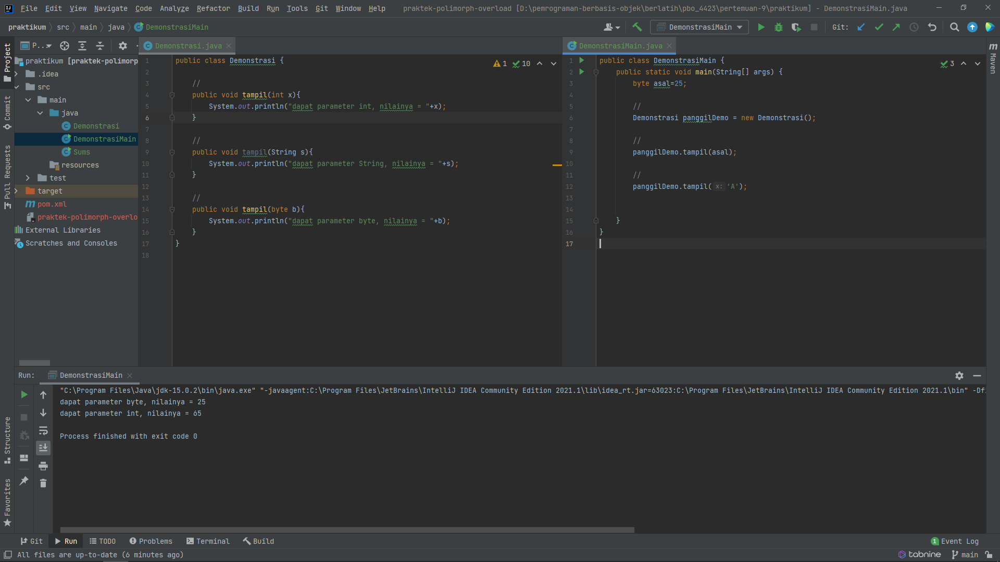
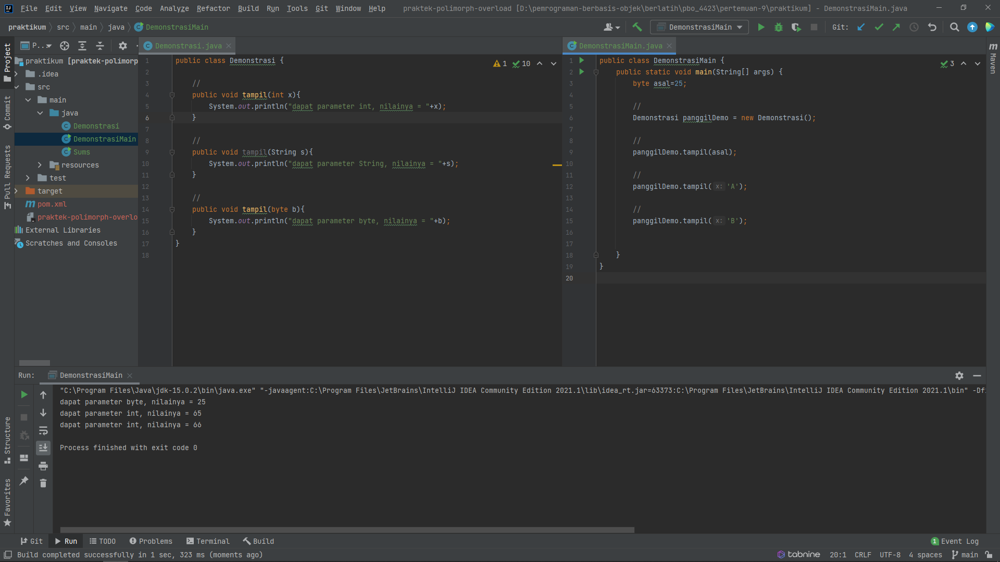
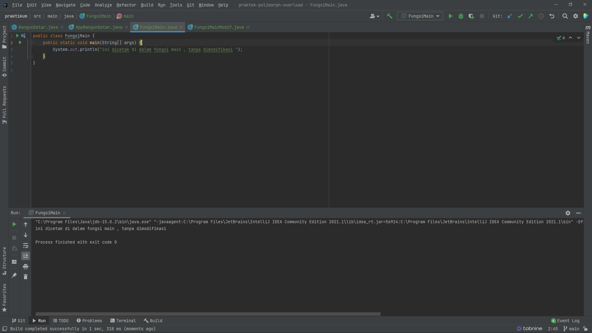
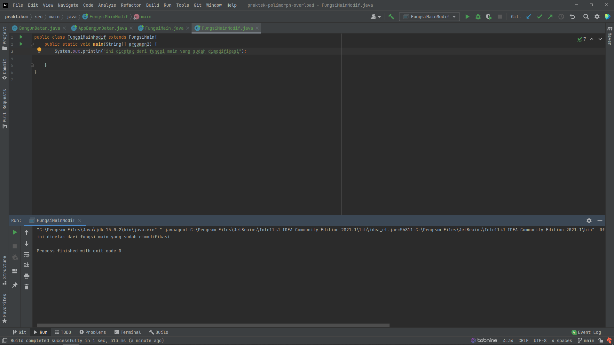

## Jawaban

**jawaban pertanyaan 1.1**

- ketika method diberi parameter yang berbeda,
method/fungsi tersebut tetap dapat dijalankan.

`panggilDemo.tampil('A')` tidak memunculkan error,
namun `'A'` sebagai argumen di dalam method tersebut,
diambil nilai integernya, dan menghasilkan `55` .

berikut adalah contoh ketika `A` diganti dengan 
huruf lain, misalnya `B`. 

Method tersebut akan menghasilkan nilai `65` .

**jawaban pertanyaan 1.2**

- penggunaan overloading dapat memudahkan 
*programmer* untuk menggunakan method yang sama 
  namun untuk kebutuhan yang berbeda.
  
Contohnya seperti pada *source code* 
dari soal 1.1 

**jawaban pertanyaan 1.3**

- `public static void main(String[] args)` dapat di-*overload* 

